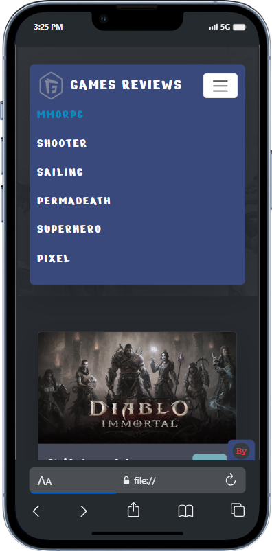

# Games-Dictionary 
provides full information about selected games depends on Free-to-Play Games Database (api)

# Live Demo :
https://omar-eldeeb98.github.io/Games-Dictionary/

# Screenshots :
,
,
,
,
,
,

# API :
https://rapidapi.com/digiwalls/api/free-to-play-games-database/

# Tools & Technologies :
html5 , css3 , bootstrap5 , responsive , javascript , api 
